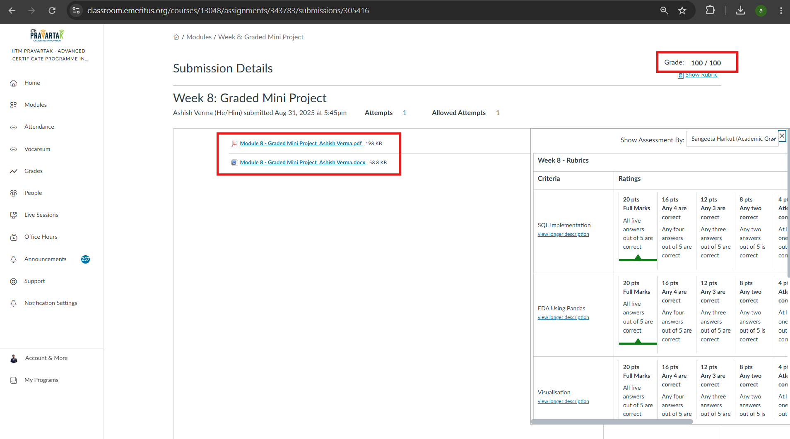

Retail Sales Analytics: SQL & Python
An academic project completed as part of the Advanced Certification Program in Applied Artificial Intelligence and Machine Learning at IITM Pravartak. This repository showcases an end-to-end data analytics workflow, demonstrating competencies in relational database querying, data wrangling, feature engineering, and visual analytics using retail transaction data.

🏆 Academic Evaluation
Grade: 100 / 100
This graded mini-project received a perfect score, reflecting complete analytical accuracy, methodological rigor, and effective data visualization.

Project Objective
The primary objective of this analysis is to extract actionable business insights from disparate retail datasets (stock inventory and sales transactions). By bridging structured SQL queries with Python-based Exploratory Data Analysis (EDA), this project models real-world data science workflows to identify bestselling inventory, temporal purchasing patterns, and customer revenue distributions.

Core Competencies Demonstrated
Relational Data Extraction: Utilizing advanced SQL aggregations and joins to synthesize multiple datasets.

Data Wrangling & Cleaning: Handling missing values, standardizing data types, and resolving data discrepancies using pandas.

Feature Engineering: Extracting temporal features (datetime parsing) and creating derived interaction metrics to enrich the dataset.

Business Intelligence & Visualization: Translating raw numerical findings into interpretable strategic insights using matplotlib.

Methodology & Analytical Approach
The project was executed across four structured phases, addressing 19 analytical tasks:

Phase 1: Data Extraction & Relational Querying (SQL)

Engineered SQL queries to filter specific inventory subset criteria based on text pattern matching.

Executed complex aggregations to calculate total quantities sold and revenue generated per customer.

Implemented INNER JOIN operations to synthesize sales transaction logs with static stock details, ensuring data integrity across tables.

Phase 2: Exploratory Data Analysis & Feature Engineering (Pandas)

Conducted rigorous data quality assessments to isolate missing values and duplicate records.

Engineered temporal features by parsing raw invoice strings into datetime objects, extracting granular Month and Hour components for time-series analysis.

Derived new continuous variables (e.g., Total Order Value) to facilitate downstream revenue analytics.

Phase 3: Visual Analytics (Matplotlib)

Designed frequency distribution bar charts to isolate the top 10 highest-volume products.

Plotted time-series line charts to identify peak operational shopping hours and overarching monthly revenue trajectories.

Developed stacked bar charts and pie charts to visualize revenue distributions and item-level contributions among the top-tier customer cohort.

Phase 4: Business Insight Generation

Quantified core business metrics, including the absolute highest-revenue product and the Global Average Order Value (AOV).

Identified outlier purchasing behavior by isolating the highest-frequency customer.

Conducted cross-table validation to flag orphaned transaction records (products sold without corresponding inventory metadata).

Technical Stack
Query Language: SQL

Programming Language: Python 3

Libraries & Frameworks: Pandas, NumPy, Matplotlib
